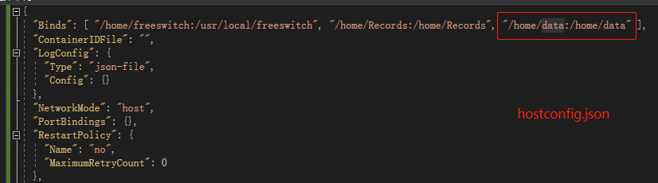

docker清除日志


```
1.指定容器日志查看
docker  logs -f   容器ID或名称

2.指定容器日志清空
echo > $(docker inspect --format='{{.LogPath}}'   容器ID或名称 )

3.查看指定容器日志最新n条
docker logs --tail=100   容器ID或名称
```


docker追加目录映射： /home/data


```
1.  下载docker配置文件到本机： config.v2.json 和 hostconfig.json 
  进入容器目录: cd /var/lib/docker/containers/b142b92d716d5e70db656f09057f93dd95b991c61d986c693808eed0467498bc
  
  
2.  hostconfig.json的根节点 Binds 增加： "/home/data:/home/data"

3.  config.v2.json 的根节点 MountPoints 增加：
    "/home/data": {
      "Source": "/home/data",
      "Destination": "/home/data",
      "RW": true,
      "Name": "",
      "Driver": "",
      "Type": "bind",
      "Propagation": "rprivate",
      "Spec": {
        "Type": "bind",
        "Source": "/home/data",
        "Target": "/home/data"
      },
      "SkipMountpointCreation": false
    },
    
4.  停止docker服务:   service docker stop

5.  上传刚刚编辑的两个配置文件到原始目录

6.  service docker start
```



使用visual studio格式化json


